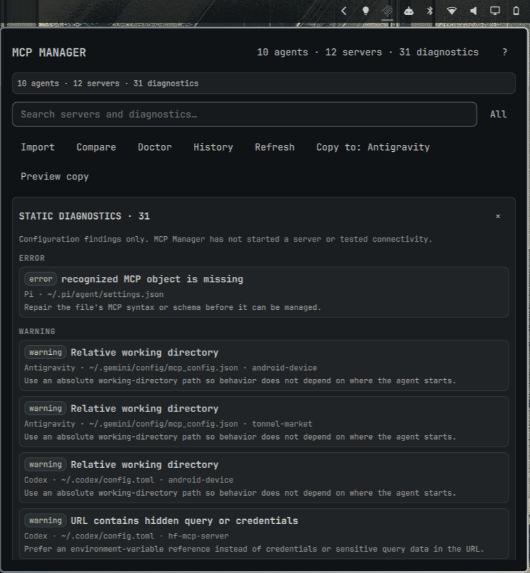

# MCP Manager

> A native Omarchy bar panel for discovering and safely managing MCP servers
> across the coding agents already configured on your machine.



MCP Manager is a local-first, offline Omarchy Quattro plugin. It combines the
selected Omarchy default agent, allowlisted executables in `PATH`, known config
files that exist, and explicit imports. It never treats the single default
agent selector or `omarchy.agents` usage-provider list as a universal registry.

## Capabilities

| Agent | Detection | Configuration capability |
| --- | --- | --- |
| Codex | executable, `~/.codex/config.toml`, default, import | Read/write for recognized TOML MCP tables |
| Claude Code | executable, `~/.claude.json`, project `.mcp.json`, import | Project JSON read/write; user state read-only |
| OpenCode | executable and XDG/user/project JSON or JSONC | Read/write for recognized legacy and v2 MCP shapes |
| Gemini CLI | executable and `~/.gemini/settings.json` | Read/write for `mcpServers` |
| Antigravity | `agy` or detected Antigravity MCP source | Read/write only for recognized JSON source shapes |
| GitHub Copilot CLI | executable and known user/project JSON sources | Read/write for recognized JSON sources |
| Crush | executable and known config candidates | `crushrc` is read-only; recognized JSON is read-only until proven |
| Pi | executable and `~/.pi/agent/settings.json` | Detect and explain; no native writer advertised |
| OMP | executable and conservative candidates | Detect and explain; no native writer |
| Grok | executable and conservative candidates | Detect and explain; no native writer |
| Generic import | explicit JSON, JSONC, or recognized Codex TOML | Read-only by default; manage-in-place is explicit and schema-gated |

Antigravity is detected separately from Gemini. A menu override that displays
Gemini while launching `agy` does not collapse the two identities.

## Install and place in the bar

Review the repository before enabling it; Omarchy plugins run unsandboxed:

```sh
omarchy plugin add https://github.com/EF-Code/omarchy-mcp-manager.git
omarchy plugin enable io.github.ef-code.mcp-manager right
```

The first scan is read-only. Click the bar icon to open the anchored panel. The
right mouse button refreshes discovery. Use `h`/`l` for agents, `j`/`k` for
servers, `[`/`]` for sources, `/` for search, `r` to refresh, `?` for help,
Enter to edit, Space to preview enable/disable, and Escape to close.

## Editing, imports, and recovery

Every supported mutation creates a redacted semantic and textual preview and
requires explicit Apply. The helper revalidates the file immediately before
writing, refuses external drift, creates a bounded owner-only backup, writes
through a same-directory temporary file, and verifies the semantic
postcondition. Restore and redacted history are available in the panel and
through the helper.

Manual imports are explicit. Register read-only for the safest inspection, or
choose manage-in-place only for the exact file after reviewing the warning.
MCP Manager stores the path and authorization mode, never the file contents.

Cross-agent copy selects the destination agent's highest-precedence writable
source and shows the converted, secret-safe payload first. Choose **Copy to…**
to generate the destination's redacted textual diff, then choose **Apply** to
commit it. Existing destination names are disclosed before planning. Embedded
URL credentials, credential-bearing arguments, environment values, and HTTP
header values are never copied automatically.

User-owned regular files with overly broad permissions remain visible through
the redacted read-only model so the problem can be diagnosed. Editing stays
disabled until the source file and its containing directory are owner-only;
MCP Manager never silently changes permissions during discovery.

## Static diagnostics are not health checks

Doctor checks syntax, schema, duplicate names, direct `PATH` presence, URL
syntax, environment-variable-name presence without reading values, relative
path risks, unsupported transports, literal-secret risks, and precedence
conflicts. It never starts an MCP server and never claims connectivity.
Individual findings can be ignored, all current findings can be cleared, and
ignored findings can be restored. Ignore state contains only opaque diagnostic
IDs in the plugin's owner-only XDG state directory; it does not contain source
paths, labels, commands, configuration values, or credentials.

## Dependencies and removal

Runtime dependencies are Omarchy Quattro/Quickshell and a portable Python 3
standard library interpreter. Node.js is used only by the JavaScript model
tests. No package manager, network service, install hook, elevated access, or
external runtime library is required.

To remove the plugin without touching agent configuration:

```sh
omarchy plugin disable io.github.ef-code.mcp-manager
omarchy plugin remove io.github.ef-code.mcp-manager
```

Removing the plugin does not delete agent MCP files. To remove only MCP
Manager's state after reviewing it, delete the
`omarchy-mcp-manager` directories under the XDG state, cache, and runtime
locations. Backups should be retained if they may be needed for recovery.

## Development and evidence

See [CONTRIBUTING.md](CONTRIBUTING.md), [SECURITY.md](SECURITY.md), and
[CHANGELOG.md](CHANGELOG.md).
Static validation, automated tests, live local
Omarchy interaction, and externally verified compatibility are separate
evidence levels; this repository does not claim more than it has tested.

## Marketplace review draft

Candidate title: `[Plugin]: MCP Manager`  
Category: `Developer Tools`  
Tags: `ai`, `bar`, `quickshell`  
Suggested missing tag: `mcp`

The active submission is [marketplace issue #2315](https://github.com/HANCORE-linux/omarchy-plugin-marketplace/issues/2315).
